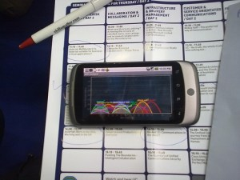
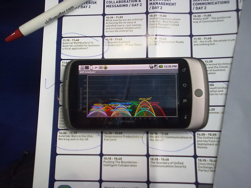

todays [UCEXPO](http://www.ucexpo.co.uk/) agenda favorites !

  

- 10:30 mobile VOIP
- 11:10 asterisk for business critical apps
- 11:50 SOA mashups & clouds
- 12:30 cost effective asterisk & open source
- 13:50 asterisk IVVR contact centers
- 14:30 hosting UC in the cloud

or 'watch it' from home via [http://twitter.com/#search?q=ucexpo](http://twitter.com/#search?q=ucexpo)  
  

  
  

  

[Read and post comments](http://osde-info.vox.com/library/post/todays-ucexpo-agenda-favorites.html?_c=feed-atom-full#comments) | [Send to a friend](http://www.vox.com/share/6a00d4141b9517685e0123f1b0cf90860f?_c=feed-atom-full)
