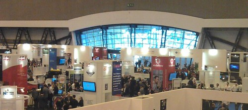

[IP EXPO](http://www.ipexpo.co.uk/ "ipexpo") 20 Oct - 21 Oct 2010 highlights

- ICE Cube DataCentre in a Container
- CloudCamp 2010
- Cloud USB Sticks from EMC
- Using SSD for 10T+ of data can be cheaper than using disks !
- Free coffee from LSI

