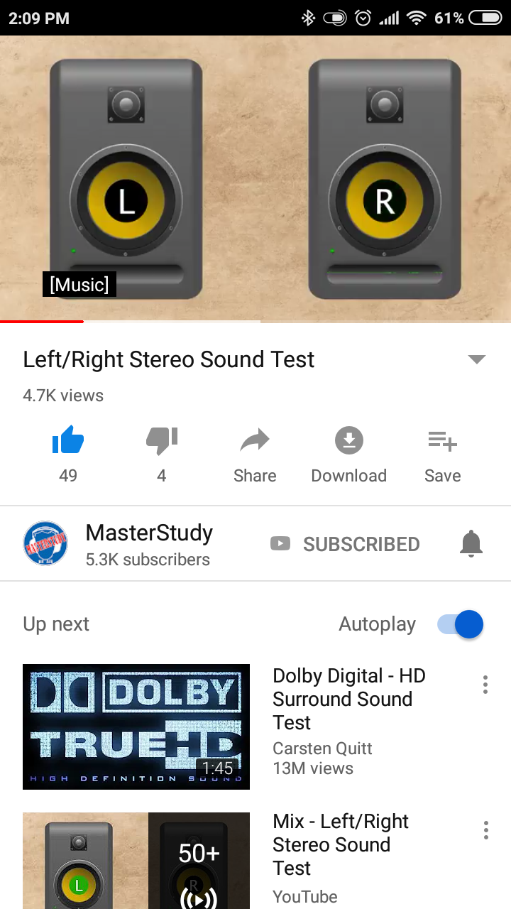
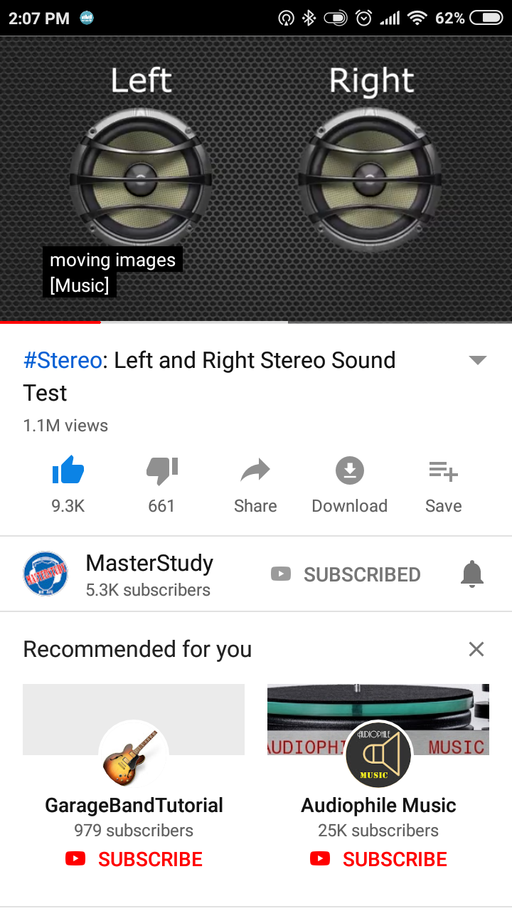

gadget of the day @thecoo technology ltd BT525 waterproof IPX7 [stereo bluetooth speakers](https://amzn.to/2RHu32l) from @amazonuk

to get TWS wireless stereo you will need to buy two [speakers](https://amzn.to/2QzMOQI) and pair them together then pair them to your phone

https://photos.app.goo.gl/XNyeBaopxViUiZAw9

https://photos.app.goo.gl/9JxNx4htSePct71T9

you will then probably want to play some @MasterStudy Stero Sound Test videos to check which one is left and which one is right

