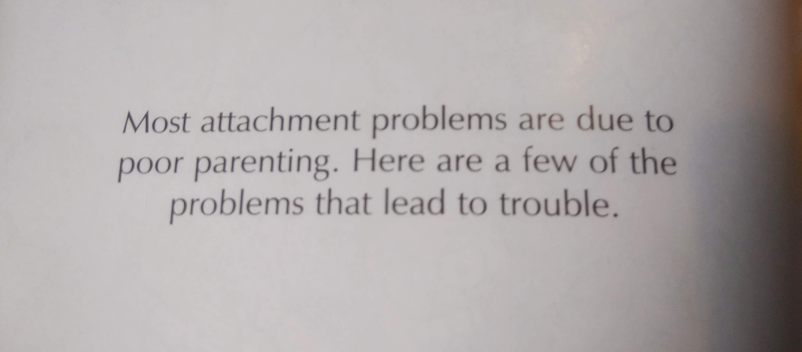

from #whatabouthechildren2017 an #attachment problems book by @JohnTimpson #childcare #mentalhealth #parenting

- http://www.whataboutthechildren.org.uk/2017-conference

_John Timpson 'The light bulb moment'_

has _sent a message to delegates and arranged for copies of two books he has written 'A Guide to Attachment' ISBN 9780957661349_

you pick up a free copy at your local Timpsons of buy a copy from amazon (but the ISBN is broken on amazon so you cant search for it)

here are a few quotes

- _the parents arent to blame_
- _occasionally children from the most caring parents can display attachment problems_
- _most attachment problems are due to poor parenting_

 

\[caption id="attachment\_8542" align="alignnone" width="4096"\] most attachment problems are due to poor parenting\[/caption\]
