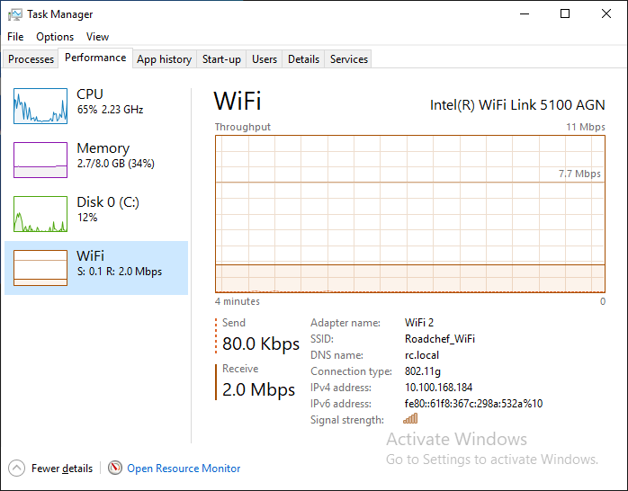
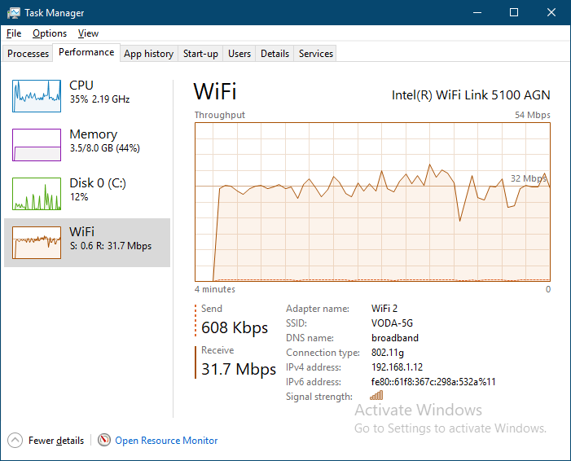

road chef #free #wi-fi is throtled to 2M

heres a clear example of what throtled bandwidth looks like - a completely flat transfer rate

unthrotled bandwidth will be uneven ̣(example from 30M VODAFONE fibre)

