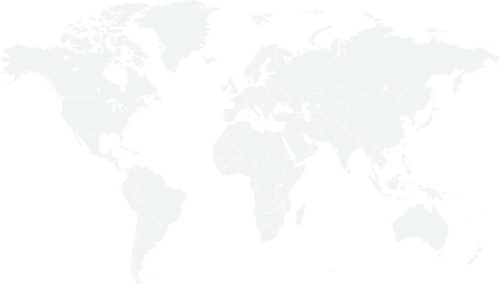

# [Fruugo](https://corporate.fruugo.com/)

## The Global Marketplace

## Fast facts

3000 +

retailers

100 m+

SKUs

over 14 .8m

orders globally worth £595m+

80 %+

of transactions cross currency

460 m

website visits in 2022

28

languages

42

countries

31

currencies

## Business overview

Today, Fruugo is a highly diversified global online marketplace supporting e-commerce transactions in 42 countries, 31 currencies and 28 languages. The business is fast-growing, asset light and built for scale through its proprietary technology platform.

Its growth is driven by the accelerating global shift towards online shopping, Fruugo’s diverse retailer base, extensive product catalogue and wide geographical reach. In addition, Fruugo’s on-going investment and improvements in its platform are continually driving higher traffic volumes, higher sales volumes and improving the overall shopping experience.

- [Fruugo Marketplace](https://sell.fruugo.com/)

- [Privacy Policy](https://corporate.fruugo.com/privacy-policy/)

- [Terms of Use](https://corporate.fruugo.com/terms-of-use/)

- [Fruugo Modern Slavery and Human Trafficking Statement 2024-2025](https://corporate.fruugo.com/modern-slavery-human-trafficking-statement/)

- 

- 

- 

- 

© 2025 Fruugo.com Ltd.

Website by [BRIGHTER\*IR](https://www.brighterir.com/)
